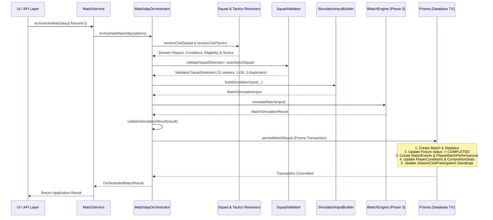

# Touchline Architecture Blueprint

## Overview

Touchline is designed as a **deep, long-term Football Manager Simulation platform**. It is **not** a playable match arcade game; matches are calculated by a sophisticated simulation engine based on player attributes, squad form, tactical setups, and controlled randomness.

To ensure long-term maintainability without requiring future rewrites, Touchline is structured as a clean **Modular Monolith**.

---

## 1. Modular Monolith Architecture

The application is structured into decoupled domain modules inside Next.js App Router:

```
src/
├── domain/        # Pure TypeScript entities, types, and interfaces (zero framework dependencies)
├── simulation/    # Deterministic & stochastic football simulation engine + RNG
├── orchestration/ # Matchday orchestration, squad selection, eligibility, & atomic persistence
├── narrative/     # AI storytelling & commentary contracts (strictly non-authoritative)
├── services/      # Application services orchestrating database and simulation pipelines
├── lib/           # Database connection (Prisma), Auth placeholders, and utility helpers
├── app/           # Next.js App Router pages and API routes (HTTP & Presentation Layer)
└── components/    # React components & UI design system
```

### Key Rule
Business and simulation logic MUST NOT leak into React components or API handlers. React components interact exclusively with Application Services via clean async signatures.

---

## 2. Strict Dependency Direction

The preferred architectural dependency flow is strictly unidirectional:

$$\text{UI Layer} \longrightarrow \text{Application Services} \longrightarrow \text{Matchday Orchestrator} \longrightarrow \text{Simulation Interface } (IMatchEngine) \longrightarrow \text{Engine Adapters}$$

### Disallowed Patterns:
- ❌ **UI Components calling simulation engine internals directly.**
- ❌ **Simulation Engine importing React, Next.js, or UI rendering logic.**
- ❌ **Simulation Engine performing direct database queries.**

---

## 3. Simulation Boundary (`IMatchEngine`)

The simulation engine is completely isolated behind the `IMatchEngine` interface:

```typescript
export interface IMatchEngine {
  readonly engineId: string;
  readonly version: string;
  simulateMatch(input: MatchSimulationInput): Promise<MatchSimulationResult> | MatchSimulationResult;
}
```

### Domain Inputs & Outputs
- **Input (`MatchSimulationInput`)**: Contains full squad states (Starting XI, bench, attributes, fitness, morale, form, sharpness, fatigue, confidence, tactical familiarity, injuries, suspensions), tactical setups (formation, mentality, pressing, line height, passing style), home/away status, and seed.
- **Output (`MatchSimulationResult`)**: Authoritative match outcome containing final score, timeline events, team statistics, and player performance ratings.

---

## 4. Ability Calculation — Two Distinct Concepts

Two separate concepts are intentionally kept apart. **Neither is persisted.**

| Concept | Source | Purpose |
|---|---|---|
| **CurrentAbility** (1–200) | Attributes + position weighting | Development tracking, scouting, transfer valuations |
| **EffectiveMatchAbility** (0–200) | CurrentAbility × condition multiplier | In-match power calculation, event weighting, ratings |

```typescript
// Attributes + position only — condition NOT involved:
type ComputeCurrentAbility = (attributes, position) => CurrentAbilityProfile;

// Current ability + full match context (condition, role, home advantage):
type ComputeEffectiveMatchAbility = (currentAbility, context) => EffectiveMatchAbilityProfile;
```

---

## 5. Seeded Randomness & Reproducibility

Randomness in Touchline is controlled using the `SeededRNG` class (based on the Mulberry32 algorithm).

### Core Principle
$$\text{Input Data} + \text{Deterministic Seed} \Longrightarrow \text{100\% Identical Simulation Output}$$

This guarantees:
1. **Explainable Bug Diagnostics**: Any match anomaly can be reproduced instantly by re-running the engine with the match seed.
2. **ML Ground Truth Evaluation**: Future ML model outputs can be benchmarked directly against deterministic baseline runs.

---

## 6. Python ML Extension Point

The architecture explicitly supports replacing or augmenting the TypeScript match engine with an external Python ML engine in future phases:

```
IMatchEngine (Interface)
├── TypeScriptMatchEngine (Default pure TS implementation)
└── PythonMLMatchEngine (Placeholder adapter for future Python service)
```

The application services and UI layer are entirely agnostic of whether `TypeScriptMatchEngine` or `PythonMLMatchEngine` is active.

---

## 7. AI Narrative Boundary

Touchline incorporates LLMs for dynamic news, match reports, board objectives, and press conferences.

### Critical Rule
The AI Narrative engine is **strictly non-authoritative**. It receives structured facts *after* the match calculation completes and converts them into natural language text.

$$\text{Simulation Engine} \xrightarrow{\text{MatchResult}} \text{Narrative AI} \xrightarrow{\text{Text Story / Report}}$$

- ✅ **Correct**: Match Engine produces 2-1 win $\rightarrow$ AI generates match report text.
- ❌ **Incorrect**: AI LLM predicts match result directly.

---

## 8. Data Model Architecture (Phase 2)

The Phase 2 database schema (PostgreSQL + Prisma) models 28 entities across these domains.

### Career Isolation (Ownership Hierarchy)

```
User
└── Career (game save — fully isolated)
    └── GameSeason (career year, e.g. 2026/27)
        └── CompetitionSeason (one edition of one competition)
            └── CompetitionPhase (structural round grouping)
                └── Fixture → Match
```

Two careers can coexist with the same year range without conflict. `GameSeason.@@unique` is scoped to `(careerId, yearStart, yearEnd)`.

### Player Club History

`Player.clubId` does **not** exist. Current club is resolved via:

```
PlayerClubRegistration WHERE playerId = X AND isActive = true LIMIT 1
```

A new `PlayerClubRegistration` is created for every transfer, loan, or signing.

### Contract History

`Contract.playerId` is **not** `@unique`. A player has many historical contracts:

```
Current contract: WHERE playerId = X AND status = 'ACTIVE' LIMIT 1
Full history:     WHERE playerId = X ORDER BY startDate DESC
```

### Standings Source of Truth

```
Match.homeScore / Match.awayScore
    → SeasonClubParticipation (played/won/drawn/lost/goals/points)

PlayerMatchPerformance
    → PlayerCompetitionStats (player-level stats: goals, assists, ratings)
```

`SeasonClubParticipation` counters derive from `Match` results — **not** from `PlayerMatchPerformance`.

---

## 9. Matchday & Simulation Orchestration (Phase 4)

Phase 4 establishes the bridge between persistent world data (Phase 2) and pure simulation execution (Phase 3).

### Execution Flow:



### Architectural Guarantees:
1. **Purity**: Phase 3 simulation engine remains 100% pure TypeScript (zero DB dependencies).
2. **Determinism**: Matches generate deterministic seeds (`generateMatchSeed`). Re-running with identical inputs & seed reproduces byte-for-byte identical outcomes.
3. **Idempotency**: Completed fixtures cannot be re-simulated. Database `@unique` index on `Match.fixtureId` prevents duplicate authoritative results.
4. **Atomicity**: Result persistence and football-world updates execute inside an atomic `prisma.$transaction`.
